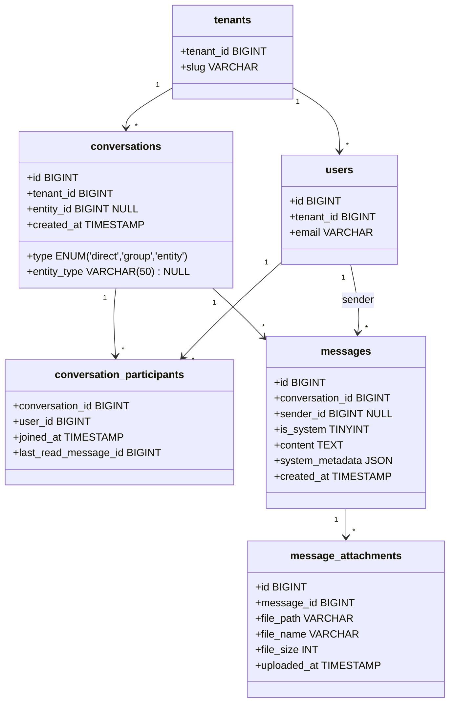

# Arquitectura del Sistema de Mensajería Unificado — kodanAPPS

Este documento detalla el diseño de arquitectura, el esquema de datos y la especificación técnica de código para el sistema de mensajería transversal de la plataforma **kodanAPPS** (CRM, Tracker y futuras aplicaciones).

---

## 1. Modelo de Datos Polimórfico y Unificado

La vinculación con las distintas aplicaciones se realiza mediante **polimorfismo ligero** (`entity_type` + `entity_id`), permitiendo asociar cualquier conversación a un Lead del CRM, un Proyecto del Tracker, o cualquier entidad futura sin alterar la base de datos de mensajería.



### Detalle de las Tablas (Esquema de Producción)

#### Tabla: `conversations`
*   `id` `BIGINT(20) UNSIGNED AUTO_INCREMENT PRIMARY KEY`
*   `tenant_id` `BIGINT(20) NOT NULL` (Foreign Key a `tenants.tenant_id`)
*   `type` `ENUM('direct', 'group', 'entity') NOT NULL DEFAULT 'entity'`
*   `entity_type` `VARCHAR(50) NULL` (ej: `'crm_opportunity'`, `'tracker_project'`, `'tracker_task'`)
*   `entity_id` `BIGINT(20) UNSIGNED NULL`
*   `created_at` `TIMESTAMP DEFAULT CURRENT_TIMESTAMP`
*   *Índices*:
    *   `idx_conv_tenant` (`tenant_id`)
    *   `uk_tenant_entity` (`tenant_id`, `entity_type`, `entity_id`) **[UNIQUE]** — Previene condiciones de carrera e hilos duplicados.

#### Tabla: `conversation_participants`
*   `conversation_id` `BIGINT(20) UNSIGNED NOT NULL` (FK a `conversations.id` ON DELETE CASCADE)
*   `user_id` `BIGINT(20) NOT NULL` (FK a `users.id` ON DELETE CASCADE)
*   `joined_at` `TIMESTAMP DEFAULT CURRENT_TIMESTAMP`
*   `last_read_message_id` `BIGINT(20) UNSIGNED NULL`
*   *PK*: `(conversation_id, user_id)`

#### Tabla: `messages`
*   `id` `BIGINT(20) AUTO_INCREMENT PRIMARY KEY`
*   `conversation_id` `BIGINT(20) UNSIGNED NOT NULL` (FK a `conversations.id` ON DELETE CASCADE)
*   `sender_id` `BIGINT(20) NULL` (FK a `users.id` ON DELETE SET NULL, NULL para eventos de sistema)
*   `is_system` `TINYINT(1) NOT NULL DEFAULT 0`
*   `content` `TEXT NOT NULL`
*   `system_metadata` `JSON NULL`
*   `created_at` `TIMESTAMP DEFAULT CURRENT_TIMESTAMP`
*   *Índices*:
    *   `idx_msg_conv_created` (`conversation_id`, `created_at` DESC)

---

## 2. Contratos y DTOs (PHP 8.3 Enterprise)

Para garantizar un código limpio, robusto y validable en **PHPStan Nivel 9**, se define el uso de tipado estricto, DTOs inmutables y Repositorios desacoplados.

### A. DTO de Envío de Mensaje
```php
<?php declare(strict_types=1);

namespace kodanAPPS\DTOs;

/**
 * DTO inmutable para la creación y validación de mensajes.
 */
final readonly class SendMessageDTO
{
    public function __construct(
        public int $conversationId,
        public ?int $senderId,
        public string $content,
        public bool $isSystem = false,
        public ?array $systemMetadata = null
    ) {}
}
```

### B. Contratos de Persistencia (Repository Interfaces)
```php
<?php declare(strict_types=1);

namespace kodanAPPS\Repositories;

use kodanAPPS\DTOs\SendMessageDTO;

interface ConversationRepositoryInterface
{
    public function findById(int $conversationId, int $tenantId): ?array;
    
    public function findByEntity(string $entityType, int $entityId, int $tenantId): ?array;
    
    public function createEntityConversation(string $entityType, int $entityId, int $tenantId): int;
    
    public function addParticipant(int $conversationId, int $userId): void;
    
    public function removeParticipant(int $conversationId, int $userId): void;
    
    public function getParticipants(int $conversationId): array;
    
    public function updateLastRead(int $conversationId, int $userId, int $messageId): void;
}

interface MessageRepositoryInterface
{
    public function save(SendMessageDTO $dto): int;
    
    public function findNewMessages(int $userId, array $conversationIds, int $lastMessageId): array;
    
    public function getUnreadCount(int $userId): int;
}
```

---

## 3. Flujo en Tiempo Real SSE (Implementación del Script PHP)

Este script implementa el endpoint de stream SSE en PHP FPM tradicional, gestionando la liberación de memoria, de bases de datos y sesiones.

```php
<?php declare(strict_types=1);

/**
 * Endpoint: /api/messages/stream
 */

header('Content-Type: text/event-stream');
header('Cache-Control: no-cache');
header('Connection: keep-alive');
header('X-Accel-Buffering: no'); // Evita que Nginx acumule el buffer en proxy

// 1. Liberar la sesión de PHP inmediatamente para no bloquear peticiones del mismo navegador
session_write_close();

$userId = (int)($_SESSION['user_id'] ?? 0);
$tenantId = (int)($_SESSION['tenant_id'] ?? 0);

if ($userId === 0 || $tenantId === 0) {
    echo "event: error\ndata: Unauthorized\n\n";
    exit;
}

// 2. Control de reconexión (Last-Event-ID)
$lastMessageId = (int)($_SERVER['HTTP_LAST_EVENT_ID'] ?? ($_GET['last_event_id'] ?? 0));

$dbConfig = require __DIR__ . '/../../config/database.php';
$pdo = new PDO($dbConfig['dsn'], $dbConfig['user'], $dbConfig['pass'], [
    PDO::ATTR_ERRMODE => PDO::ERRMODE_EXCEPTION,
    PDO::ATTR_DEFAULT_FETCH_MODE => PDO::FETCH_ASSOC
]);

// Cargar conversaciones activas del usuario
$stmt = $pdo->prepare('SELECT conversation_id FROM conversation_participants WHERE user_id = :user_id');
$stmt->execute(['user_id' => $userId]);
$conversationIds = $stmt->fetchAll(PDO::FETCH_COLUMN);

if (empty($conversationIds)) {
    // Si no tiene chats, mantener el stream vivo
    while (true) {
        echo ": keep-alive\n\n";
        ob_flush();
        flush();
        sleep(60);
    }
}

// 3. Bucle de envío controlado (Idempotente y no-bloqueante)
while (true) {
    // Si la conexión se cortó desde el cliente, salir del script
    if (connection_aborted()) {
        break;
    }

    // Re-instanciar conexión si fue liberada
    if ($pdo === null) {
        $pdo = new PDO($dbConfig['dsn'], $dbConfig['user'], $dbConfig['pass'], [
            PDO::ATTR_ERRMODE => PDO::ERRMODE_EXCEPTION,
            PDO::ATTR_DEFAULT_FETCH_MODE => PDO::FETCH_ASSOC
        ]);
    }

    // Consultar nuevos mensajes
    $placeholders = implode(',', array_fill(0, count($conversationIds), '?'));
    $query = "SELECT m.*, u.display_name as sender_name 
              FROM messages m 
              LEFT JOIN users u ON u.id = m.sender_id
              WHERE m.conversation_id IN ($placeholders) 
                AND m.id > ? 
              ORDER BY m.id ASC";
              
    $stmt = $pdo->prepare($query);
    $params = array_merge($conversationIds, [$lastMessageId]);
    $stmt->execute($params);
    $newMessages = $stmt->fetchAll();

    if (!empty($newMessages)) {
        foreach ($newMessages as $msg) {
            $lastMessageId = (int)$msg['id'];
            echo "id: {$lastMessageId}\n";
            echo "event: message\n";
            echo "data: " . json_encode($msg, JSON_UNESCAPED_UNICODE) . "\n\n";
        }
        
        // Enviar también el contador total actualizado de no leídos
        $unreadStmt = $pdo->prepare("
            SELECT COUNT(m.id) as unread_count
            FROM conversation_participants cp
            JOIN messages m ON m.conversation_id = cp.conversation_id
            WHERE cp.user_id = :user_id
              AND (cp.last_read_message_id IS NULL OR m.id > cp.last_read_message_id)
        ");
        $unreadStmt->execute(['user_id' => $userId]);
        $unreadCount = (int)$unreadStmt->fetchColumn();
        
        echo "event: unread_update\n";
        echo "data: {\"unread_count\": {$unreadCount}}\n\n";
    } else {
        // Enviar heartbeat para mantener viva la conexión
        echo ": keep-alive\n\n";
    }

    ob_flush();
    flush();

    // 4. Liberar conexión a la base de datos durante el reposo
    $pdo = null;
    $stmt = null;

    usleep(60000000); // 60 segundos (1 minuto)
}
```

---

## 4. Parser de Menciones Directas (@mentions) Seguro

El parser en el backend debe validar que el usuario arrobado pertenezca al mismo `tenant_id` que el emisor de la conversación (Prevención de fuga de información / IDOR).

```php
<?php declare(strict_types=1);

namespace kodanAPPS\Services;

use PDO;

final readonly class MentionsParser
{
    public function __construct(private PDO $pdo) {}

    /**
     * Parsea menciones del tipo @[Nombre](user:123) y suscribe al usuario si pertenece al mismo tenant.
     */
    public function processMentions(string $content, int $conversationId, int $tenantId): void
    {
        preg_match_all('/user:(\d+)/', $content, $matches);
        
        if (empty($matches[1])) {
            return;
        }

        $userIds = array_map('intval', $matches[1]);
        
        // Validar estrictamente la pertenencia al tenant
        $placeholders = implode(',', array_fill(0, count($userIds), '?'));
        $query = "SELECT id FROM users WHERE id IN ($placeholders) AND tenant_id = ?";
        
        $stmt = $this->pdo->prepare($query);
        $params = array_merge($userIds, [$tenantId]);
        $stmt->execute($params);
        $validUserIds = $stmt->fetchAll(PDO::FETCH_COLUMN);

        if (empty($validUserIds)) {
            return;
        }

        // Suscribir usuarios válidos a la conversación
        $insertQuery = "INSERT IGNORE INTO conversation_participants (conversation_id, user_id) VALUES (?, ?)";
        $insertStmt = $this->pdo->prepare($insertQuery);
        
        foreach ($validUserIds as $validUserId) {
            $insertStmt->execute([$conversationId, $validUserId]);
            
            // Registrar mención para alertas
            $mentionQuery = "INSERT IGNORE INTO message_mentions (message_id, user_id) VALUES (?, ?)";
            // Nota: message_id debe ser inyectado por el servicio de mensajería una vez guardado
        }
    }
}
```

---

## 5. Lógica de Participación Dinámica y Sincronización de Owners

### A. Sincronización Automática ante Cambios de Propietario (Owner Change)
Cuando una Tarea o Proyecto se reasigna a otro usuario, la aplicación debe disparar la sincronización para actualizar la campanita de alertas:

```php
<?php declare(strict_types=1);

namespace kodanAPPS\Services;

use kodanAPPS\Repositories\ConversationRepositoryInterface;

final readonly class EntityOwnerSyncService
{
    public function __construct(private ConversationRepositoryInterface $conversations) {}

    /**
     * Sincroniza la participación al cambiar el owner de una entidad.
     */
    public function syncOwner(string $entityType, int $entityId, int $tenantId, int $oldOwnerId, int $newOwnerId): void
    {
        $conv = $this->conversations->findByEntity($entityType, $entityId, $tenantId);
        if ($conv === null) {
            return;
        }

        $conversationId = (int)$conv['id'];

        // 1. Suscribir al nuevo owner
        $this->conversations->addParticipant($conversationId, $newOwnerId);

        // 2. Dar de baja al owner anterior (solo si no interactuó explícitamente enviando mensajes)
        // Esto se valida verificando si el oldOwnerId no tiene mensajes escritos en esta conversación
        $this->conversations->removeParticipant($conversationId, $oldOwnerId);
    }
}
```

---

## 6. Frontend: React 19 Custom Hook y Componente Premium

La interfaz se integra mediante un panel lateral derecho deslizable (Side Drawer) que utiliza animaciones de aceleración por hardware.

### A. Custom Hook de Escucha SSE (`useSSE.ts`)
```typescript
import { useEffect, useState } from "react";

interface Message {
  id: number;
  conversation_id: number;
  sender_id: number | null;
  sender_name: string | null;
  content: string;
  is_system: number;
  created_at: string;
}

export function useSSE(apiStreamUrl: string) {
  const [messages, setMessages] = useState<Message[]>([]);
  const [unreadCount, setUnreadCount] = useState<number>(0);
  const [error, setError] = useState<string | null>(null);

  useEffect(() => {
    let lastEventId = localStorage.getItem("last_event_id") || "0";
    
    // Conectar al endpoint SSE agregando el last_event_id como fallback query string
    const url = `${apiStreamUrl}?last_event_id=${lastEventId}`;
    const eventSource = new EventSource(url, { withCredentials: true });

    eventSource.onmessage = (event) => {
      const msg: Message = JSON.parse(event.data);
      setMessages((prev) => [...prev, msg]);
      
      if (event.lastEventId) {
        localStorage.setItem("last_event_id", event.lastEventId);
      }
    };

    // Escuchar actualizaciones dinámicas del badge
    eventSource.addEventListener("unread_update", (event: any) => {
      const data = JSON.parse(event.data);
      setUnreadCount(data.unread_count);
    });

    eventSource.onerror = () => {
      setError("Conexión perdida con el servidor de mensajería.");
      eventSource.close();
    };

    return () => {
      eventSource.close();
    };
  }, [apiStreamUrl]);

  return { messages, unreadCount, error };
}
```

### B. Estructura de UI Premium (Side Drawer y Doble Bisel en Tailwind)
```tsx
import React, { useTransition } from "react";

interface DrawerProps {
  isOpen: boolean;
  onClose: () => void;
  conversationId: number;
}

export const MessageDrawer: React.FC<DrawerProps> = ({ isOpen, onClose, conversationId }) => {
  const [isPending, startTransition] = useTransition();

  const handleSendMessage = (e: React.FormEvent<HTMLFormElement>) => {
    e.preventDefault();
    const formData = new FormData(e.currentTarget);
    const text = formData.get("content") as string;

    startTransition(async () => {
      await fetch(`/api/conversations/${conversationId}/messages`, {
        method: "POST",
        headers: { "Content-Type": "application/json" },
        body: JSON.stringify({ content: text }),
      });
    });
  };

  return (
    <div
      role="dialog"
      aria-hidden={!isOpen}
      className={`fixed top-0 right-0 h-full w-[400px] z-50 bg-slate-900/90 backdrop-blur-xl border-l border-white/5 transition-transform duration-300 ease-[cubic-bezier(0.16,1,0.3,1)] ${
        isOpen ? "translate-x-0" : "translate-x-full"
      }`}
      style={{ willChange: "transform" }}
    >
      {/* Doble Bisel en Cabecera (Sombra ultra-difusa y borde sutil) */}
      <div className="flex justify-between items-center px-6 py-4 border-b border-white/5 shadow-[inset_0_1px_0_rgba(255,255,255,0.05)] bg-slate-950/40">
        <h3 className="text-white font-semibold text-lg tracking-wide">Mensajería</h3>
        <button
          onClick={onClose}
          aria-label="Cerrar panel de chat"
          className="text-slate-400 hover:text-white transition-colors duration-200 cursor-pointer"
        >
          ✕
        </button>
      </div>

      {/* Cuerpo del Chat */}
      <div className="flex-1 overflow-y-auto px-6 py-4 h-[calc(100%-140px)] scroll-smooth">
        {/* Renderizado de Burbujas y Mensajes del Sistema */}
      </div>

      {/* Input de Mensaje con Doble Bisel y Botón con masa cinética */}
      <form onSubmit={handleSendMessage} className="absolute bottom-0 left-0 w-full p-4 bg-slate-950/60 border-t border-white/5 flex gap-2">
        <input
          type="text"
          name="content"
          placeholder="Escribe un mensaje..."
          className="flex-1 bg-slate-900 border border-white/10 rounded-lg px-4 py-2 text-white focus:outline-none focus:ring-1 focus:ring-indigo-500 placeholder-slate-500"
          required
        />
        <button
          type="submit"
          disabled={isPending}
          className="bg-indigo-600 hover:bg-indigo-500 text-white rounded-lg px-4 py-2 font-medium cursor-pointer transition-transform duration-150 active:scale-95 disabled:opacity-50"
        >
          {isPending ? "..." : "Enviar"}
        </button>
      </form>
    </div>
  );
};
```

---

## 8. Protocolos de Seguridad y Multitenancy

Apegado a las reglas del backend y seguridad:
1.  **Aislamiento de Consultas (Anti-Leak)**:
    *   Todas las consultas al endpoint de mensajería (tanto SSE como REST) deben validar en la cláusula `WHERE` que `conversations.tenant_id = :current_user_tenant_id`.
    *   NUNCA confiar en un `tenant_id` enviado desde el cliente en la petición. Este debe resolverse en el backend a partir de la sesión o del token JWT del usuario logueado.
2.  **Autorización basada en Roles de la App (`user_roles`)**:
    *   Para conversaciones de tipo `'entity'`, antes de permitir el acceso de lectura o escritura a un chat asociado (ej: un Proyecto en Tracker), el backend debe validar que el usuario posee permisos para dicha aplicación consultando la tabla `user_roles` (`user_id`, `app_id`).
3.  **Sanitización y Validación de Entrada (Prevención XSS/SQLi)**:
    *   El contenido del mensaje se almacena sanitizado en la base de datos.
    *   En el frontend, el renderizado de texto debe escapar HTML por defecto (evitando el uso de `dangerouslySetInnerHTML` en React sin sanitización estricta por librerías como DOMPurify).

---

## 9. Guía de Ejecución y Migración de Base de Datos

Para migrar la base de datos de producción de forma segura y sin pérdida de datos históricos de chats, ejecute la migración independiente en PHP:

```bash
php migrations/008_unify_messaging_system.php
```

El script modificará la tabla `messages`, creará las nuevas tablas unificadas `conversations` y `conversation_participants`, migrará el histórico del CRM y eliminará los constraints heredados obsoletos de forma segura en una transacción atómica.
